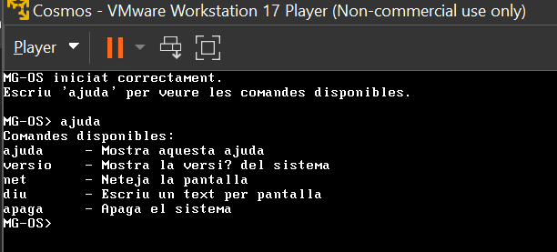

# 🖥️ MG-OS

Sistema operatiu educatiu desenvolupat amb Cosmos per aprendre com funciona un SO des de dins.


---

## 🌟 Característiques destacades

- 🧠 Sistema operatiu creat des de zero amb Cosmos (.NET/C#)
- 👨‍💻 Projecte desenvolupat per 2 estudiants
- 🔧 Centrat en l’aprenentatge de:
  - Gestió de memòria
  - Entrada/sortida (I/O)
  - Interacció amb el maquinari bàsic
  - Sistema de fitxers
  - Xarxa
  - Interfície gràfica
- 📚 Ideal per iniciar-se en el desenvolupament de sistemes operatius
- 🚀 Projecte open-source en evolució

---

## ℹ️ Descripció

MG-OS és un sistema operatiu educatiu desenvolupat amb el framework Cosmos, amb l’objectiu d’entendre el funcionament intern d’un sistema operatiu.

Aquest projecte no pretén competir amb sistemes com Windows o Linux, sinó servir com a eina pràctica per comprendre conceptes fonamentals com:

- El procés d’arrencada d’un sistema operatiu
- La interacció amb el maquinari
- El funcionament d’un shell de comandes
- El sistema de fitxers
- La configuració de xarxa
- La creació d’una interfície gràfica amb Cosmos CGS

---

## 👥 Autors

- Manel Sanchez – desenvolupament del kernel  
- Gerard Leiva – disseny del shell i comandes  

Projecte desenvolupat dins l’àmbit formatiu d’ASIX.

---

## 🛠️ Tecnologies utilitzades

- 💻 C#
- ⚙️ .NET
- 🧠 Cosmos OS Framework
- 🎨 Cosmos Graphic Subsystem (CGS)
- 💾 Cosmos VFS
- 🌐 Cosmos Network
- 🔊 PC Speaker
- 🧪 Visual Studio
- 🗃️ Git i GitHub
- 🖥️ Màquina virtual VMware / VirtualBox

---

## 🎯 Objectiu del projecte

Els objectius principals de MG-OS són:

- Aprendre el desenvolupament de sistemes operatius
- Practicar programació en C# a baix nivell
- Entendre el funcionament intern d’un SO
- Crear un shell propi amb comandes bàsiques
- Treballar amb fitxers, gràfics, so i xarxa
- Crear una base per a futurs experiments i millores

---

## 🚀 Execució

Exemple bàsic de funcionament del kernel:

```csharp
public override void Run()
{
    Console.WriteLine("Benvingut a MG-OS");
}
```

Actualment, MG-OS ja no funciona només amb consola clàssica, sinó que utilitza una interfície gràfica amb Cosmos CGS i entrada de text en temps real.

---

## ⬇️ Instal·lació

### 🔧 Requisits

- Visual Studio  
- .NET compatible amb Cosmos  
- Cosmos User Kit  
- VMware o VirtualBox  

### 📦 Passos

1. Instal·lar Cosmos User Kit  
2. Clonar el repositori:

```bash
git clone https://github.com/tu-usuari/MG-OS.git
```

3. Obrir el projecte amb Visual Studio  
4. Compilar el projecte  
5. Executar-lo amb Cosmos en una màquina virtual  

---

## 📁 Estructura del projecte

```txt
MG-OS/
├── assets/
│   ├── imatge-ajuda-mg-os.png
│   ├── logoMG-OS.png
│
├── MG-OS/
│   ├── bin/
│   ├── obj/
│   ├── Kernel.cs
│   ├── MG-OS.csproj
│
├── .gitignore
├── LICENSE
├── MG-OS.sln
├── README.md
```

---

## ⌨️ Configuració del teclat

S’ha configurat el teclat de MG-OS amb la distribució espanyola/europea, ja que Cosmos OS utilitza per defecte el teclat americà.

Aquesta configuració s’ha afegit dins de la funció `BeforeRun()` del kernel:

```csharp
Sys.KeyboardManager.SetKeyLayout(new Sys.ScanMaps.ESStandardLayout());
```

---

## 💾 Sistema de fitxers

MG-OS implementa un sistema de fitxers inicial seguint la guia oficial de Cosmos OS sobre VFS:

https://cosmosos.github.io/articles/Kernel/VFS.html

Per inicialitzar el sistema de fitxers, s’ha creat una instància de `CosmosVFS` i s’ha registrat amb `VFSManager` dins de la funció `BeforeRun()`:

```csharp
fs = new Sys.FileSystem.CosmosVFS();
Sys.FileSystem.VFS.VFSManager.RegisterVFS(fs);
```

### Comandes de fitxers implementades

- `llista` → mostra el contingut del directori actual
- `crea [directori]` → crea un directori nou
- `entra [directori]` → canvia de directori
- `entra ..` → torna al directori arrel
- `borra [directori]` → elimina un directori buit
- `mostra [fitxer]` → mostra el contingut d’un fitxer

---

## 🔊 Sistema de so

MG-OS incorpora una funcionalitat bàsica de so utilitzant el PC Speaker de Cosmos OS.

S’han implementat diferents sons per millorar la interacció amb l’usuari:

### 🔈 Sons implementats

- 🔊 **Inici del sistema**  
  Es reprodueix un doble beep quan el sistema operatiu arrenca correctament.

- ✅ **Comanda correcta**  
  Es reprodueix un beep agut quan l’usuari introdueix una comanda vàlida.

- ❌ **Error**  
  Es reprodueix un beep greu quan la comanda no és reconeguda o hi ha un error.

### ⚙️ Implementació

Els sons s’han implementat mitjançant la classe `PCSpeaker` de Cosmos:

```csharp
Cosmos.System.PCSpeaker.Beep(freq, durada);
```

---

## 🧠 Memòria de comandes

MG-OS incorpora una memòria de comandes que permet guardar les últimes cinc comandes executades.

Aquesta funcionalitat facilita recuperar ordres utilitzades anteriorment i tornar-les a executar sense haver-les d’escriure completament.

### Comandes afegides

#### `historial`

Mostra les últimes cinc comandes executades.

```txt
historial
```

#### `repeteix`

Permet tornar a executar una comanda anterior indicant el seu número dins de l’historial.

```txt
repeteix 1
```

---

## 🎨 Interfície gràfica amb Cosmos CGS

MG-OS ha evolucionat d’una consola simple a una interfície gràfica utilitzant Cosmos Graphic Subsystem (CGS).

S’ha implementat un sistema visual basat en `Canvas` que permet dibuixar elements gràfics com:

- Fons amb colors personalitzats
- Finestres i contenidors amb rectangles
- Text renderitzat sobre pantalla
- Pantalla de benvinguda gràfica
- Capçalera amb nom del sistema, ruta i versió
- Zona de sortida del sistema
- Zona d’entrada de comandes

Guia oficial utilitzada:

https://cosmosos.github.io/articles/Kernel/CGS.html

---

## ⌨️ Input interactiu en temps real

El sistema ja no depèn només de `Console.ReadLine()`, sinó que captura les tecles amb `Console.ReadKey()`.

Això permet:

- Visualitzar el text mentre s’escriu
- Esborrar amb Backspace
- Executar comandes amb Enter
- Simular el comportament d’una terminal real dins de la interfície gràfica

---

## 🌐 Xarxa i FTP

MG-OS incorpora una configuració inicial de xarxa seguint la guia oficial de Cosmos OS:

https://cosmosos.github.io/articles/Kernel/Network.html

S’ha configurat una adreça IP estàtica per a la màquina virtual:

```txt
IP: 192.168.1.69
Mascara: 255.255.255.0
Gateway: 192.168.1.1
```

### Comandes de xarxa

#### `xarxa`

Mostra la configuració completa de xarxa.

```txt
xarxa
```

#### `ip`

Mostra l’adreça IP actual del sistema.

```txt
ip
```

#### `ftp`

Mostra la configuració necessària per accedir al directori publicat mitjançant FTP.

```txt
ftp
```

### Configuració recomanada per FileZilla

- Protocol: FTP
- Xifratge: FTP plain
- Usuari: anonymous
- Mode: active
- Host: 192.168.1.69
- Directori publicat: `0:\`

---

## 🧪 Estat del projecte

🚧 En desenvolupament

### Funcionalitats actuals

- Arrencada del sistema  
- Interfície gràfica amb Cosmos CGS  
- Pantalla de benvinguda gràfica  
- Sistema de comandes shell  
- Input en temps real  
- Sistema de fitxers bàsic  
- Operacions aritmètiques  
- Historial de comandes  
- Recuperació i repetició de comandes anteriors  
- Sistema de so amb PC Speaker  
- Configuració del teclat espanyol/europeu  
- Configuració de xarxa amb IP estàtica  
- Comanda `ip` per mostrar l’adreça IP  
- Comanda `xarxa` per mostrar la configuració de xarxa  
- Preparació de directori per FTP  
- Apagat i reinici del sistema  

### Millores previstes

- Millora del sistema de fitxers  
- Implementació completa del servidor FTP  
- Gestió de memòria  
- Millora visual de la interfície gràfica  
- Afegir més informació del sistema  
- Millora de la navegació entre directoris  

---

## 💡 Contribucions

Aquest és un projecte d’aprenentatge, però qualsevol aportació és benvinguda.

Pots:

- Obrir incidències (issues) 🐛  
- Proposar millores 🚀  
- Donar feedback 💬  

---

## 📖 Finalitat educativa

MG-OS està pensat com una eina d’aprenentatge.  
Si estàs començant en sistemes operatius, aquest projecte et pot ajudar a entendre conceptes clau de manera pràctica.

---

## 📜 Llicència

Aquest projecte està sota la llicència MIT.

---

## 🖥️ Comandes del shell de MG-OS

Per al disseny del shell de MG-OS, s’ha definit un conjunt de comandes bàsiques orientades a un ús senzill del sistema operatiu.

S’han escollit noms curts i clars, evitant copiar directament les comandes de Linux.

---

### 📁 Gestió de fitxers i directoris

#### `llista`

Mostra el contingut del directori actual.

```txt
llista
```

#### `entra`

Canvia el directori actual.

```txt
entra documents
```

També permet tornar al directori arrel:

```txt
entra ..
```

#### `crea`

Crea un directori nou.

```txt
crea projecte
```

#### `borra`

Elimina un directori buit.

```txt
borra proves
```

#### `mostra`

Mostra el contingut d’un fitxer.

```txt
mostra notes.txt
```

---

### ⚙️ Informació del sistema

#### `ajuda`

Mostra les comandes disponibles.

```txt
ajuda
```



#### `versio`

Mostra la versió del sistema.

```txt
versio
```

---

### 🌐 Xarxa

#### `ip`

Mostra l’adreça IP actual del sistema.

```txt
ip
```

#### `xarxa`

Mostra la configuració de xarxa.

```txt
xarxa
```

#### `ftp`

Mostra la configuració FTP preparada per accedir al directori publicat.

```txt
ftp
```

---

### 🧠 Historial de comandes

#### `historial`

Mostra les últimes cinc comandes executades.

```txt
historial
```

#### `repeteix`

Executa una comanda anterior de l’historial.

```txt
repeteix 1
```

---

### 🧰 Útils

#### `net`

Neteja la pantalla o la zona de sortida.

```txt
net
```

#### `diu`

Mostra text per pantalla.

```txt
diu Hola MG-OS
```

#### `apaga`

Apaga el sistema.

```txt
apaga
```

#### `reinicia`

Reinicia el sistema.

```txt
reinicia
```

---

### 🧮 Operacions aritmètiques

#### `suma`

Suma dos nombres.

```txt
suma 5 3
```

#### `resta`

Resta dos nombres.

```txt
resta 10 4
```

#### `mult`

Multiplica dos nombres.

```txt
mult 6 2
```

#### `div`

Divideix dos nombres.

```txt
div 8 2
```

#### `mod`

Calcula el mòdul entre dos nombres.

```txt
mod 10 3
```

#### `arrel`

Calcula l’arrel quadrada d’un nombre.

```txt
arrel 25
```

---

## 🗺️ Roadmap

- [x] Arrencada del sistema
- [x] Sortida per consola
- [x] Implementació inicial del shell
- [x] Sistema bàsic de comandes
- [x] Operacions aritmètiques bàsiques
- [x] Configuració del teclat
- [x] Sistema de fitxers inicial
- [x] Sistema de so
- [x] Memòria de comandes
- [x] Interfície gràfica amb Cosmos CGS
- [x] Input en temps real
- [x] Configuració de xarxa
- [x] Comandes `ip`, `xarxa` i `ftp`
- [ ] Gestió de memòria
- [ ] Servidor FTP complet
- [ ] Millora del sistema de fitxers
- [ ] Millora visual de la interfície