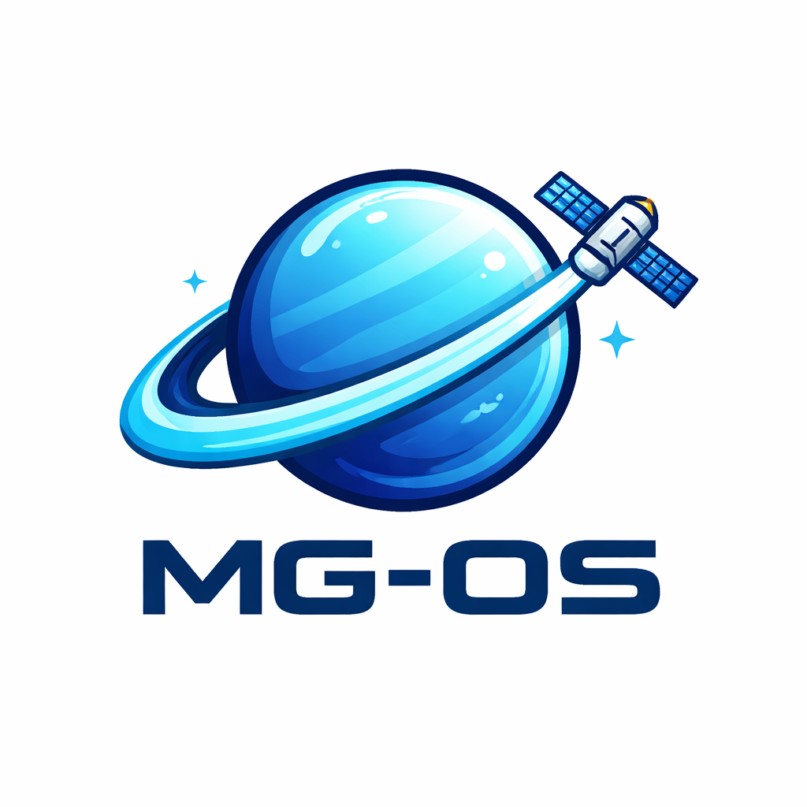

# 🖥️ MG-OS

Sistema operatiu educatiu desenvolupat amb Cosmos per aprendre com funciona un SO des de dins.



---

## 🌟 Característiques destacades

- 🧠 Sistema operatiu creat des de zero amb Cosmos (.NET/C#)
- 👨‍💻 Projecte desenvolupat per 2 estudiants
- 🔧 Centrat en l’aprenentatge de:
  - Gestió de memòria
  - Entrada/sortida (I/O)
  - Interacció amb el maquinari bàsic
- 📚 Ideal per iniciar-se en el desenvolupament de sistemes operatius
- 🚀 Projecte open-source en evolució

---

## ℹ️ Descripció

MG-OS és un sistema operatiu educatiu desenvolupat amb el framework Cosmos, amb l’objectiu d’entendre el funcionament intern d’un sistema operatiu.

Aquest projecte no pretén competir amb sistemes com Windows o Linux, sinó servir com a eina pràctica per comprendre conceptes fonamentals com:

- El procés d’arrencada d’un sistema operatiu
- La interacció amb el maquinari
- La gestió de processos bàsics
- El funcionament d’una consola o interfície simple

---

## 👥 Autors

- Manel Sanchez – desenvolupament del kernel  
- Gerard Leiva – disseny del shell i comandes  

Projecte desenvolupat dins l’àmbit formatiu d’ASIX.

---

## 🛠️ Tecnologies utilitzades

- 💻 C#
- ⚙️ .NET
- 🧠 Cosmos OS Framework
- 🧪 Visual Studio
- 🗃️ Git i GitHub
- 🖥️ Màquina virtual (VMware / VirtualBox)

---

## 🎯 Objectiu del projecte

Els objectius principals de MG-OS són:

- Aprendre el desenvolupament de sistemes operatius
- Practicar programació en C# a baix nivell
- Entendre el funcionament intern d’un SO
- Crear una base per a futurs experiments i millores

---

## 🚀 Execució

Exemple bàsic de funcionament:

```csharp
public override void Run()
{
    Console.WriteLine("Benvingut a MG-OS");
}
```

## ⬇️ Instal·lació

### 🔧 Requisits

- Visual Studio  
- .NET compatible amb Cosmos  
- Cosmos User Kit  

### 📦 Passos

1. Instal·lar Cosmos User Kit  
2. Clonar el repositori:

```bash
git clone https://github.com/tu-usuari/MG-OS.git
```

MG-OS/
├── assets/
│   ├── imatge-ajuda-mg-os.png
│   ├── logoMG-OS.png
│
├── src/
│   └── Kernel.cs
│
├── .gitignore
├── LICENSE
├── MG-OS.sln
├── README.md

## ⌨️ Configuració del teclat

S’ha configurat el teclat de MG-OS amb la distribució espanyola/europea, ja que Cosmos OS utilitza per defecte el teclat americà.

Aquesta configuració s’ha afegit dins de la funció `BeforeRun()` del kernel:

```csharp
Sys.KeyboardManager.SetKeyLayout(new Sys.ScanMaps.ESStandardLayout());
```

## 🧪 Estat del projecte

🚧 En desenvolupament

### Funcionalitats actuals

- Arrencada bàsica del sistema  
- Sortida per consola  
- Estructura inicial del kernel  
- Sistema bàsic de comandes (shell)  
- Comanda d’apagat del sistema  
- Comanda de reinici del sistema  
- Operacions aritmètiques bàsiques des del terminal  

### Millores previstes

- Gestió de memòria  
- Sistema de fitxers  
- Millora del sistema de comandes  
- Interfície més avançada  

---

## 💡 Contribucions

Aquest és un projecte d’aprenentatge, però qualsevol aportació és benvinguda.

Pots:

- Obrir incidències (issues) 🐛  
- Proposar millores 🚀  
- Donar feedback 💬  

---

## 📖 Finalitat educativa

MG-OS està pensat com una eina d’aprenentatge.  
Si estàs començant en sistemes operatius, aquest projecte et pot ajudar a entendre conceptes clau de manera pràctica.

---

## 📜 Llicència

Aquest projecte està sota la llicència MIT.

## 🖥️ Comandes inicials del shell de MG-OS

Per al disseny del shell mínim de MG-OS, s’ha definit un conjunt de comandes bàsiques orientades a un ús senzill del sistema operatiu.

S’han escollit noms curts i clars, evitant copiar directament les comandes de Linux.

---

### 📁 Gestió de fitxers i directoris

#### `llista`
Mostra el contingut del directori actual.

```txt id="zns3n2"
llista
```

#### `entra`
Canvia el directori actual.

```txt id="zns3n2"
entra documents
```

#### `crea`
Crea un directori nou.

```txt id="zns3n2"
crea projecte
```

#### `borra`
Elimina un directori (buit).

```txt id="zns3n2"
borra proves
```

#### `mostra`
Mostra el contingut d’un fitxer.

```txt id="zns3n2"
mostra notes.txt
```

### ⚙️ Informació del sistema

#### `ajuda`
Mostra les comandes disponibles.

```txt id="zns3n2"
ajuda
```

#### `versio`
Mostra la versió del sistema.

```txt id="zns3n2"
versio
```

#### `mem`
Mostra la memòria disponible.

```txt id="zns3n2"
mem
```

#### `temps`
Mostra el temps de funcionament.

```txt id="zns3n2"
temps
```

### 🧰 Útils

#### `net`
Neteja la pantalla.

```txt id="zns3n2"
net
```

#### `diu`
Mostra text per pantalla.

```txt id="zns3n2"
diu Hola MG-OS
```

#### `apaga`
Apaga el sistema.

```txt id="zns3n2"
apaga
```

#### `reinicia`
Reinicia el sistema.

```txt id="zns3n2"
reinicia
```

### 🧮 Operacions aritmètiques

#### `suma`
Suma dos nombres.

```txt id="zns3n2"
suma 5 3
```

#### `resta`
Resta dos nombres.

```txt id="zns3n2"
resta 10 4
```

#### `mult`
Multiplica dos nombres.

```txt id="zns3n2"
mult 6 2
```

#### `div`
Divideix dos nombres.

```txt id="zns3n2"
div 8 2
```

#### `mod`
Calcula el mòdul entre dos nombres.

```txt id="zns3n2"
mod 10 3
```

#### `arrel`
Calcula l’arrel quadrada d’un nombre.

```txt id="zns3n2"
arrel 25
```

## 🗺️ Roadmap
- [x] Arrencada del sistema
- [x] Sortida per consola
- [x] Implementació inicial del shell
- [x] Sistema bàsic de comandes
- [x] Operacions aritmètiques bàsiques
- [ ] Gestió de memòria
- [ ] Sistema de fitxers
